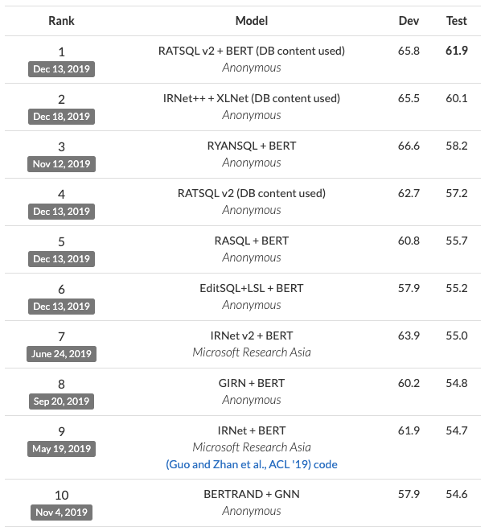
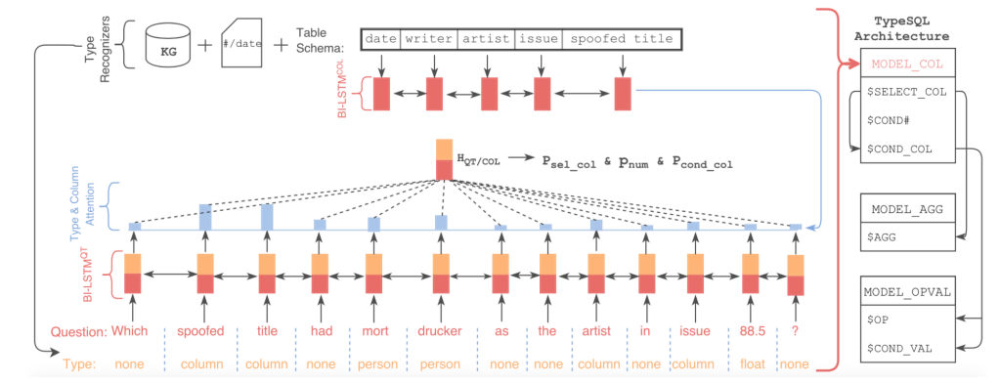
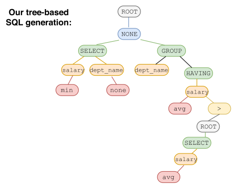
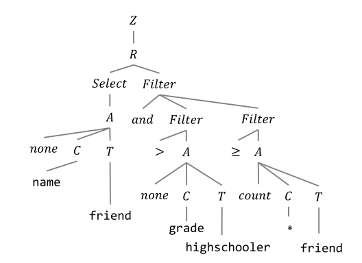
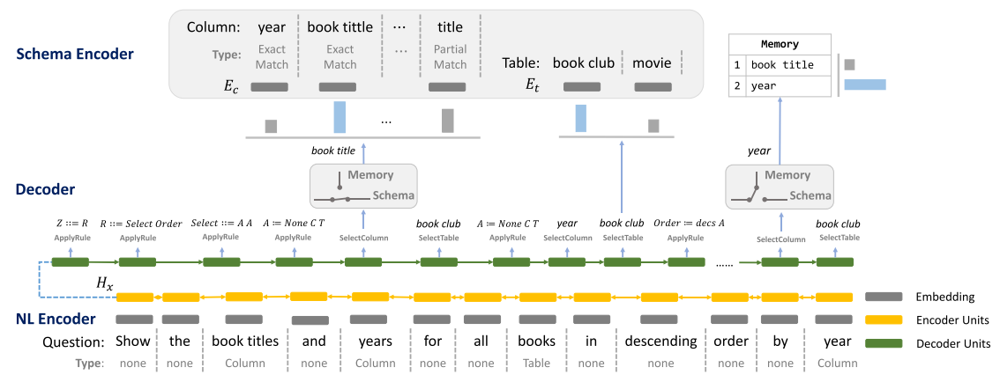
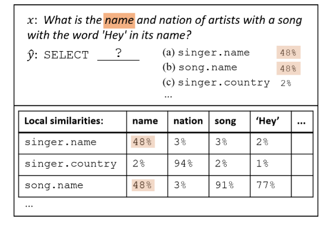
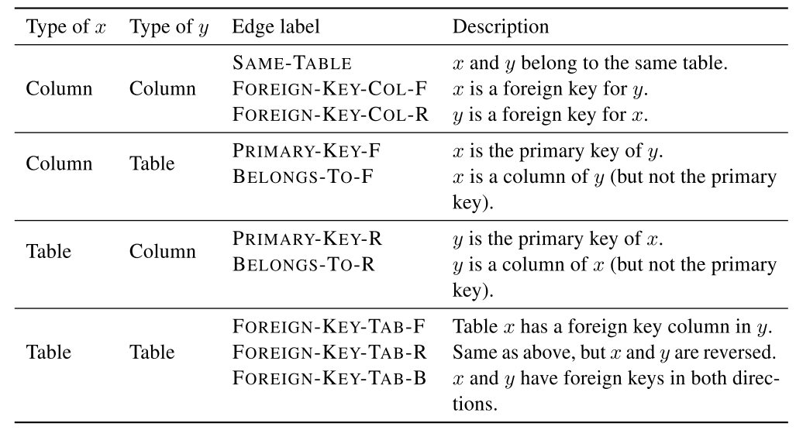

# 赛尔笔记|Text-to-SQL任务介绍

## 作者：窦隆绪、潘名扬、乔振浩

## 任务介绍

Text-to-SQL任务是一个semantic parsing在特定领域的具体应用，非常具有实用价值，主要包括1）提高基于知识库的问答系统（KBQA）的性能 2）辅助人们对数据库进行查询。目前这个研究问题引起了学术界和工业界的广泛关注，有着丰富的数据集资源，包括wikiSQL以及耶鲁大学发布的Spider、SparC、CoSQL，西湖大学日前也公布中文版的Spider数据集。追一科技日前也在天池数据平台举行了第一届中文text2sql挑战赛。

Text-to-SQL任务更为正式的定位为：在指定关系型数据库（或表）的前提下，由用户的提问生成相应的SQL查询语句。用户的提问可以是上下文无关的，例如：

也可以是上下文关联的：

​	

在本篇文章中，我们首先会对SQL生成的相关数据集进行介绍，之后介绍Spider（上下文无关、跨领域）数据集上的主流模型。

 

##  相关数据集介绍

#### 1.ATIS

ATIS（Air Travel Information System），是关于航班信息的、由用户提问生成SQL语句的单一领域、上下文相关的数据集，采用了BIO标注的方式来标识问句中所包含的的表名和查询条件等。

#### 2.GeoQuery

是与地理区域相关的，单一领域、上下文无关的数据集。特点：按照问句所表达的含义进行分组，每一组表示同一类查询，每组提供几个SQL语句。

####  3.SequentialQA

SequentialQA是跨领域的，上下文相关的数据集。对于每一个表，给数据集给出了三组上下文相关的提问，并给出了对应的查询结果（没有直接给出SQL语句）。 

#### 4.WikiSQL

WikiSQL是跨领域的，上下文无关的数据集。来源于英文维基百科，数据规模较大。但是SQL语句结构较为简单，不需要进行选取表的操作，Where子句的条件使用and连接。

#### 5.Spider

Spider是跨领域的，上下文无关的数据集。领域比较丰富（拥有来自138个领域的200多个数据库），并且训练集、测试集中出现的数据库不重合。SQL语句更为复杂，包含orderBy、union、except、groupBy、intersect、limit、having 关键字，以及嵌套查询等。并且该数据集依据SQL语句的复杂程度，将数据分为了四个难度等级。下面是Hard和Extra Hard的实例：

#### 6.Sparc

SParC是跨领域的，上下文相关的数据集。数据库基于Spider，并且模拟了用户进行数据库查询的过程：用户通过若干条相关的提问最后达到一个最终查询目的。

 

不同数据集对比：

 Spider Benchmark（截止12.19日）：

## 问题分析

Text-to-SQL在某种程度上可以看做是一个翻译任务

## 主流工作

我们将模型分为上下文无关（1-8），上下文相关（9-10）两种类型。

#### 1.Pointer Network

传统的seq2seq模型的解码器部分所使用的单词表是固定的，即在生成序列中都是从固定的单词表中进行选取。但Text-to-SQL不同于一般的seq2seq任务，它的生成序列中可能出现：a）问句中的单词; b) SQL关键字; c)对应数据库中的表名、列名。

Pointer Network很好地解决了这一问题，其输出所用到的词表是随输入而变化的。具体做法是利用注意力机制，直接从输入序列中选取单词作为输出。

在Text-to-SQL任务中，可以考虑把用户的提问以及目标SQL语句可能出现的其他词作为输入序列 (列名单词序列；SQL的关键字表；问题的单词序列)，利用Pointer Network直接从输入序列中选取单词作为输出。在解码器的每一步，与编码器的每一个隐层状态计算注意力分数，取最大值作为当前的输出以及下一步的输入。

#### 2.Seq2SQL

Pointer Network虽然一定程度上解决了问题，但是它并没有利用到SQL语句固有的语法结构。Seq2SQL将生成的SQL语句分为三个部分： 聚合操作：（SUM、COUNT、MIN、MAX等）、SELECT：选取列、WHERE：查询条件。每一部分使用不同的方法进行计算。

SELECT与聚合操作，均采用了注意力机制进行分类。WHERE子句可以利用前面介绍的Pointer Network进行训练，但是对于很多查询来说，WHERE子句的写法并不是唯一的，例如：

SELECT name FROM insurance WHERE age > 18 AND gender = "male";

SELECT name FROM insurance WHERE gender = "male" AND age > 18;

这可能导致原本正确的输出被判断为错误的。于是作者提出利用强化学习基于查询结果来进行优化。在解码器部分，对可能的输出进行采样，产生若干个SQL语句，每一句表示为y=[y1,y2...yT]，用打分函数对每一句进行打分：

#### 3.SQLNet

为了解决Seq2SQL使用强化学习效果不明显的问题，SQLNet将SQL语句分成了SELECT和WHERE两个部分，每个部分设置了几个槽位，只需向槽位中填入相应的符号即可。  

SELECT子句部分与Seq2SQL类似，不同地方在于WHERE子句，它使用了一种sequence-to-set（由序列生成集合）机制，用于选取目标SQL语句中的WHERE子句可能出现的列。对于表中的每一列给出一个概率。之后计算出WHERE子句中的条件个数k，然后选取概率最高的前k个列。最后通过注意力机制进行分类得到操作符和条件值。

 

#### 4.TypeSQL

该模型基于SQLNet，使用模版填充的方法生成SQL语句。为了更好地建模文本中出现的罕见实体和数字，TypeSQL显式地赋予每个单词类型。

类型识别过程：将问句分割n-gram （n取2到6），并搜索数据库表、列。对于匹配成功的部分赋值column类型赋予数字、日期四种类型：INTEGER、FLOAT、DATE、YEAR。对于命名实体，通过搜索FREEBASE，确定5种类型：PERSON，PLACE，COUNTREY，ORGANIZATION，SPORT。这五种类型包括了大部分实体类型。当可以访问数据库内容时，进一步将匹配到的实体标记为具体列名（而不只是column类型）

SQLNet为模版中的每一种成分设定了单独的模型；TypeSQL对此进行了改进，对于相似的成分，例如$SELECT_COL 和$COND_COL以及#COND（条件数），这些信息间有依赖关系，通过合并为了单一模型，可以更好建模。TypeSQL使用3个独立模型来预测模版填充值：

MODEL_COL：$SELECT_COL，$COND#，$COND_COL

MODEL_AGG：$AGG

MODEL_OPVAL：$OP, $COND_VAL

#### 5.SyntaxSQLNet

相比于之前decoder输出一段线性的文本，SyntaxSQLNet将解码的过程引入了结构性信息，即解码的对象为SQL语句构成的树结构。（准确率+14.8%）

SyntaxSQLNet将SQL语句的预测分解为9个模块，每个模块对应了SQL语句中的一种成分。解码时由预定义的SQL文法确定这9个模块的调用顺序，从而引入结构信息。树的生成顺序为深度优先。分解出的9个模块有：

IUEN模块：预测INTERCEPT、UNION、EXCEPT、NONE（嵌套查询相关）

KW模块：预测WHERE、GROUP BY、ORDER BY、SELECT关键字

COL模块：预测列名

OP模块：预测>、<、=、LIKE等运算符

AGG模块：预测MAX、MIN、SUM等聚合函数

Root/Terminal模块：预测子查询或终结符

Module模块：预测子查询或终结符

AND/OR模块：预测条件表达式间的关系

DESC/ASC/LIMIT模块：预测与ORDER BY相关联的关键字

HAVING模块：预测与GROUP BY相关的Having从句

 

该工作同时提供了一种针对text2sql任务的数据增强方法，生成跨领域、更多样的训练数据。（准确率++7.5%）

具体做法为：对SPIDER中的每条数据，将值和列名信息除去，得到一个模版； 对处理后的SQL模版进行聚类，通过规则去除比较简单的模版，并依据模板出现的频率，挑选50个复杂SQL模板； 人工核对SQL-问句对，确保SQL模板中每个槽在问句中都有对应类型的信息。

得到一一对应的模板后，应用于WikiSQL数据库：首先随机挑选10个模板，然后从库中选择相同类型的列，最后用列名和值填充SQL模板和问句模板。通过该方法，作者最终在18000的WikiSQL数据库上得到了新的98000组训练数据，同时在训练的时候也利用了WikiSQL数据集原有的训练数据。

#### 6.IRNet

与SyntaxSQLNet类似，IRNet定义了一系列的CFG文法，将SQL转发为语法树结构。可以将其看作一种自然语言与SQL语句间的中间表示（作者称之为SemQL），整个parsing的过程也是针对SemQL进行的。如下：

作者另一部分的改进主要在scheme linking，即如何找到问题中所提到的表格与列。他将问题中可能出现的实体分为3类：表格名、列名、表中的值。根据3类实体的不同，具体做法分为：a）表格名和列名：以n-gram的形式枚举问题中的span，然后和表格名、列名进行匹配。可以看到下图中的Question中对应的单词有的被标成了Column或者Table。 b) 表中的值：将问题中以引号为开头结尾的span，送给conceptnet进行查询，再将返回结果中的 ‘is a type of’/'related terms'关系的词与列名进行匹配。

#### 7.Global-GNN

为了更好的利用关系型数据库的结构信息，Ben Bogin等研究人员提出使用图网络来建模表格名和列名。如下图所示：圆圈加粗的结点代表表格，不加粗的结点代表列名；双向边代表表格和列名的从属关系；红虚边和蓝虚边代表主外键关系。橙色节点代表与问题有关的结果，淡色为无关。

除此之外，该团队还提出了一种基于全局信息重排序的做法。首先先看下面这个例子，我们不知道name到底指向的是singer还是song，但是我们可以观察到nation只在singer中出现，所以应该是singer.name。这样做global reasoning，就能减小歧义性。

整个工作的流程如下图所示：

 

#### 8.RAT-SQL

该工作可以看做图网络建模的后续工作，在Table、Column、Quetion三者之间定义了更多的边（共33种），是目前榜单上的最强模型。

### 

 

## 总结

目前，SQL生成任务因其实用的应用场景，引起了学术界和工业界的广泛关注。目前大家的做法也是百花齐放：中间表示、树形解码、图网络建模Quetion和数据库间的关系、重排序、数据增强。但目前的模型，还不能很好解决复杂的操作，例如IRNet在Hard和Extra Hard的准确率也仅为48.1%和25.3%。期待后面能有更加有效、简洁、优雅的工作出现。

 

### 相关引用：

1. Seq2sql: Generating structured queries from natural language using reinforcement learning

2. Towards Complex Text-to-SQL in Cross-Domain Database with Intermediate Representation

3. SParC: Cross-Domain Semantic Parsing in Context

4. CoSQL: A Conversational Text-to-SQL Challenge Towards Cross-Domain Natural Language Interfaces to Databases

5. Pointer Networks

6. Neural semantic parsing with type constraints for semi-structured tables

7. SQLNet: Generating Structured Queries From Natural Language Without Reinforcement Learning

8. TypeSQL: Knowledge-based Type-Aware Neural Text-to-SQL Generation

9. SyntaxSQLNet: Syntax Tree Networks for Complex and Cross-DomainText-to-SQL Task

10. Editing-Based SQL Query Generation for Cross-Domain Context-Dependent Questions

11. Towards Complex Text-to-SQL in Cross-Domain Database with Intermediate Representation

12. Global Reasoning over Database Structures for Text-to-SQL Parsing

13. RAT-SQL: Relation-Aware Schema Encoding and Linking for Text-to-SQL Parsers

14. Learning to Map Context-Dependent Sentences to Executable Formal Queries

 

 

 

 

 